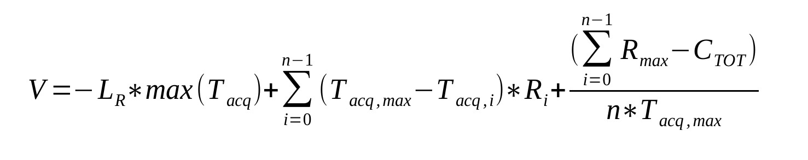
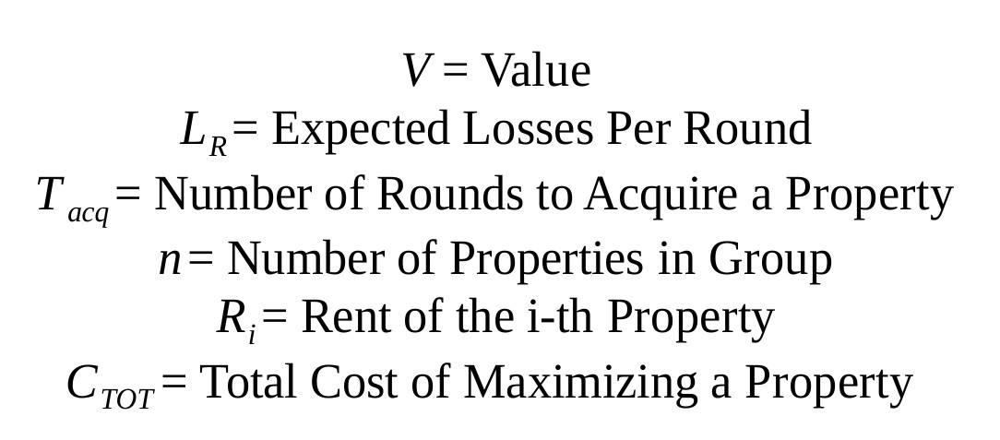

# A Naive Simulation of the popular game, Monopoly

While browsing through YouTube, I came across this video discussing how Monopoly doesn't have each position at the same probability and some are more likely than others. I decided to take this as a task for myself and make this *(naive)* simulation of the game. What followed was a couple of hours of coding, plotting and preparing this text, all while having my Monopoly board open on the side to ensure accurate information in the code. 

## Probability Distribution of Different Positions on the Board
Different positions in the board are referred to by their index position in a 40-element array *(because the game board has 40 places on it)*. A million simulations of a single player, 100-turn games was run. In reality, the game would be slightly longer than 100 turns and the sum total of your turns in the simulated result will come out to be greater than 100. This is because I made the assumption that **a double turn or a triple turn counted as a single turn**. Obviously, that is all a matter of semantics so keep that in mind. In addition, the player when in Jail would be able to get out if they got a double roll or had a "Get Out of Jail Free" card with them. This has been accounted for. 

## Value for Money and Return on Investment
Obviously, the probability distribution is not of much significance without mentioning the value for money and return on investment provided by each property group. This was calculated by the formula, 

where,

The reasoning takes into account the following - 
* The costlier the property, the higher the rent. Thus, there needs to be a linear dependence term here.
* However, the costlier the property, the tougher it is to acquire the property group and provide construction. Because of this, we will face a negative feedback like term for each property group. 
* We also assume that the player will try and avoid getting any other property group and focus only on completing the group they currently have. Obviously, this completely falls apart in real world scenarios where players are motivated to buy multiple properties for various other purposes, including trade. *(There is no simple way of simulating this behavior as far as I can tell and probably needs to be looked at as a Deep Learning problem)*
* Finally, we come to hotels houses and this is another heavy expense which again becomes tough to model really.

## Results 
The expected gains/losses per round can be calculated as a sum of the following -
* Earnings from crossing Go *= 200*
* Losses from Income Taxes *= -200, -100*
* Average Gains/Losses from Chance *= +21.5174*
* Average Gains/Losses from Community Chest *= +37.8125*

*(As this is a single player simulation, we do not have losses and earnings from rent)*

Multiplying by the probability of visiting each per round, we get the folliwing rough estimate - 
Net Gain Per Round = 3.3235

#### Probability Distribution Graphs
The probability distribution graphs for arriving at a certain property are as follows 

#### Value for Money of Different Property Groups
We get the Value for Money of the different groups as shown in the graph below

